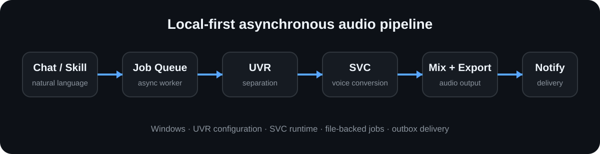

# AIVOICE / AI Cover Studio

Windows-first local AI cover pipeline: natural-language requests are resolved into local audio jobs, processed through UVR/SVC, and delivered as finished audio.

> [!IMPORTANT]
> AIVOICE is an engineering and research project, not a licensed music distribution service. The MIT license in this repository applies to software code only. It does not grant rights to third-party songs, recordings, model weights, voice likenesses, datasets, trademarks, or bundled tools.

```text
Chat / Hermes Skill
        |
Music source + Voice Registry
        |
File-backed job queue / worker
        |
UVR separation -> SVC conversion -> mix / export
        |
Outbox / notifier -> finished audio
```

<p align="center">
  
</p>

## Current Status

`v1.0.0` is the first stable personal-use release. The maintainer has exercised the local GPU pipeline and async delivery path end to end, but the public repository is still being prepared for broader open-source reproducibility.

Known publication constraints:

- This repository ships **code only**: no voice checkpoint, no UVR weight, no song, and no generated audio.
- Public demo assets must be replaced with materials that have clear redistribution rights.
- No verified runtime UI screenshots are currently available in this repository. Needed screenshots: desktop main window, job queue/progress, and a completed output or notification view.
- Large CUDA/SVC runtime environments are intentionally not stored in Git.
- The bundled Hermes skill under `hermes_skill/` is a reference integration written for one personal deployment. It expects the maintainer's own voice ids and local runtime layout, so adapt it (or ignore it and use the GUI/CLI) before reusing it.

## Highlights

| Capability | Current implementation |
| --- | --- |
| Natural-language requests | Hermes skill and Feishu entry path |
| Music input | Local file, URL, and source adapter path |
| Voice selection | `config/voices.json` registry, not hard-coded in the skill |
| Vocal separation | UVR configuration path |
| Voice conversion | so-vits-svc-compatible checkpoint/config path |
| Long-running jobs | File-backed queue plus on-demand worker |
| Delivery | Outbox and notifier path |
| Desktop use | PyQt GUI entry remains available |

## Quick Start

Requirements:

- Windows
- Python 3.10+
- Git (Git LFS only matters if you contribute example assets)
- ffmpeg on `PATH`
- A compatible local GPU/runtime for the UVR and SVC configuration you choose
- Your own rights-cleared voice model and UVR model; none are bundled

```powershell
git clone https://github.com/beyoda/ai-cover-studio.git
cd ai-cover-studio

python -m venv .venv
.\.venv\Scripts\activate
pip install -e .
```

Then check what is still missing:

```powershell
.\scripts\setup_tools.ps1
```

`setup_tools.ps1` is **diagnostic by default**. It downloads nothing, copies no model into any runtime path, and never rewrites your configuration files. It reports each missing component with the next step, and `-Strict` exits non-zero when something required is absent, so it cannot claim success for an environment that is not runnable. Add `-CloneSvcSource` if you also want it to clone the upstream so-vits-svc source tree into `tools\so-vits-svc`.

If `tools\so-vits-svc\workenv\python.exe` is missing, create or copy a local CUDA/SVC environment there, or point `svc.python` in `config\svc.yaml` at your own interpreter. The repository does not ship the multi-gigabyte runtime.

## Bring Your Own Models

Nothing model-related is distributed with this repository. To run the pipeline in real (non-mock) mode you supply:

| Component | Where it goes | Notes |
| --- | --- | --- |
| Voice checkpoint + matching config | under `models_dir` from `config/voices.json` (default `tools/so-vits-svc/logs/44k`) | so-vits-svc 4.x generator checkpoint such as `G_10000.pth` |
| Vocal separation model | `models/uvr/` (git-ignored) | filename must match `uvr.model_name` in `config/uvr.yaml` |
| so-vits-svc runtime | `tools/so-vits-svc/workenv/` (git-ignored) | CUDA Python environment; see `config/svc.yaml` |
| Input audio | anywhere you like | you must hold the rights to the recording |

`config/svc.yaml` and `config/uvr.yaml` ship with portable relative paths and are meant to be edited locally. Please do not commit machine-specific absolute paths; see [`ROADMAP.md`](ROADMAP.md).

## Running

Start the Hermes gateway:

```powershell
hermes gateway run
```

Drain queued work manually:

```powershell
$env:PYTHONPATH="src"
.\.venv\Scripts\python.exe -m aivoice_studio.worker --drain
```

Launch the desktop GUI:

```powershell
.\AI Cover Studio.bat
```

or:

```powershell
$env:PYTHONPATH="src"
.\.venv\Scripts\python.exe -m aivoice_studio
```

## Voice Registry

The source of truth for compatible voices is [`config/voices.json`](config/voices.json). Each entry maps a friendly `voice_id` and aliases to a so-vits-svc generator checkpoint and matching configuration file under `models_dir`.

The shipped file is an empty template: one `example_voice` entry with `"enabled": false` and `default_voice_id: null`. Nothing resolves until you register a voice you are authorized to use.

Minimal entry (also documented in [docs/MODEL_GUIDE.md](docs/MODEL_GUIDE.md)):

```json
{
  "my_voice": {
    "display_name": "My Voice",
    "description": "Authorized demo voice",
    "checkpoint": "G_10000.pth",
    "config": "config.json",
    "enabled": true,
    "metadata": {
      "language": "zh",
      "style": "pop"
    },
    "aliases": ["my_voice", "My Voice"]
  }
}
```

Verified behavior from the current code:

- `VoiceRegistry.load()` reads `config/voices.json` by default.
- `models_dir` defaults to `tools/so-vits-svc/logs/44k` when omitted.
- Lookup accepts `voice_id`, display name, checkpoint stem, and aliases.
- `voice_id` takes priority over legacy `model_name` in cover requests.
- Disabled entries are hidden from listings and cannot be resolved.
- The Hermes skill reads the registry when listing voices.

See [docs/MODEL_GUIDE.md](docs/MODEL_GUIDE.md) for the verified model format and asset replacement steps.

## Repository Map

| Path | Purpose |
| --- | --- |
| `src/aivoice_studio/` | Core application code |
| `src/aivoice_studio/worker/` | Async job execution |
| `src/aivoice_studio/notifier/` | Completion delivery |
| `hermes_skill/media/aivoice-cover/` | Hermes/Feishu skill integration (personal deployment reference) |
| `config/` | Runtime and voice configuration |
| `scripts/` | Setup, diagnostics, and helper scripts |
| `docs/` | Model, legal, and architecture documentation |
| `examples/` | Placeholder docs for user-supplied authorized examples |
| `tests/` | Unit, contract, and configuration-consistency tests |

## Demo Assets

No copyrighted song, celebrity voice model, or third-party UVR/SVC weight is tracked in this repository. [`examples/`](examples/README.md) holds documentation only; the corresponding `.pth`, `.onnx`, `.mp3`, and `.wav` paths are git-ignored, and `tests/test_voice_registry_integration.py` fails if any such file is ever committed.

Acceptable replacements:

- a self-recorded or contributor-authorized voice model;
- synthetic or public-domain source audio with clear provenance;
- model weights whose license explicitly allows redistribution in this repo;
- short real UI screenshots captured from a local run, with private paths and account data removed.

## Tests

```powershell
.\.venv\Scripts\python.exe -m pytest
```

The suite runs without any model, GPU, or network access. It covers the Voice Registry, the cover-request adapter, the worker, and a set of configuration-consistency guards (portable paths, no silent downloads, no committed model assets, README links).

## Roadmap

See [ROADMAP.md](ROADMAP.md).

## Contributing

Bug reports, portability fixes, documentation improvements, reproducibility work, and rights-cleared examples are welcome. Read [CONTRIBUTING.md](CONTRIBUTING.md) before opening a pull request.

For security-sensitive reports, follow [SECURITY.md](SECURITY.md).

## License

Repository software code is licensed under the MIT License; see [LICENSE](LICENSE). This license does not apply to third-party models, datasets, songs, recordings, voices, likenesses, trademarks, or external tools. See [docs/DISCLAIMER.md](docs/DISCLAIMER.md).
