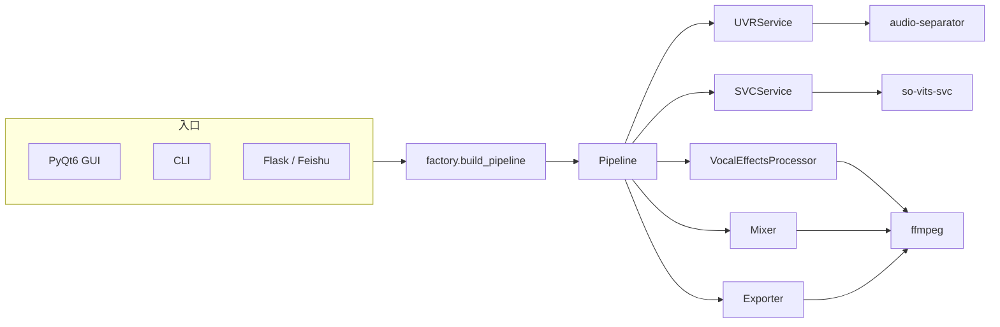

# AI Cover Studio — 架构分析报告

> 分析日期：2026-07-26  
> 范围：当前工作区只读盘点（未改代码）  
> 项目名：`aivoice-studio` / AI Cover Studio v1.0（`pyproject.toml` 版本为 `0.1.0`）

---

## 1. 项目一句话

Windows 本地 AI 翻唱工具：输入歌曲 → UVR 人声分离 → so-vits-svc 音色转换 → ffmpeg 混音/导出 → 得到 cover WAV/MP3。  
对外端入口有三套：**PyQt6 桌面 GUI**、**CLI**、**Flask Web/飞书机器人**。

---

## 2. 目录结构

```
repo/
├── AI Cover Studio.bat          # 用户启动菜单（硬编码本机绝对路径）
├── pyproject.toml               # 包定义、入口脚本、最小依赖
├── requirements.txt             # 与 pyproject 基本一致（含 dev 工具）
├── README.md
├── config/                      # YAML 配置（运行时合并）
│   ├── default.yaml             # app / runtime / pipeline
│   ├── uvr.yaml                 # audio-separator 命令与模型
│   ├── svc.yaml                 # so-vits-svc 路径与推理命令
│   └── mix.yaml                 # ffmpeg 混音参数
├── scripts/
│   ├── setup.ps1                # venv + pip install -e .[dev]
│   ├── run_gui.ps1              # GUI
│   ├── run_cli.ps1              # CLI
│   ├── run_server.ps1           # Web/飞书（入口有问题，见 §6）
│   ├── launch.py                # Flask + 浏览器（实际可用的 Web 启动器）
│   └── build_exe.ps1            # PyInstaller 打包 GUI
├── src/aivoice_studio/          # 主 Python 包
│   ├── __main__.py              # → cli.main
│   ├── app.py                   # GUI 入口
│   ├── cli.py                   # CLI 入口
│   ├── factory.py               # 组装 Pipeline
│   ├── core/                    # 流水线编排与任务上下文
│   ├── models/                  # 结果 DTO（被 .gitignore 误伤，见 §6）
│   ├── modules/                 # UVR / SVC / Mixer / 占位扩展
│   ├── ui/                      # PyQt6 界面
│   ├── server/                  # Flask API + 飞书 Blueprint
│   └── utils/                   # 配置、路径、进程、日志
├── tests/                       # pytest（mock 流水线 + 配置加载）
├── models/                      # UVR 等权重（gitignore，本地资产）
├── tools/                       # so-vits-svc 等外部工具（gitignore）
├── workdir/ / outputs/ / logs/  # 运行时产物（gitignore）
└── uploads/ / feishu_uploads/ / playlists/
```

**分层意图（设计目标）：**

```
UI / CLI / Server
        ↓
    factory.build_pipeline()
        ↓
      Pipeline (core)
        ↓
   UVR → SVC → VocalFX → Mixer → Exporter
        ↓
  外部进程：audio-separator / so-vits-svc / ffmpeg
```

---

## 3. 入口文件

| 入口 | 路径 | 触发方式 | 职责 |
|------|------|----------|------|
| 用户菜单 | `AI Cover Studio.bat` | 双击 | 选 GUI / Web / 清缓存 |
| GUI | `src/aivoice_studio/app.py` → `ui/main_window.py` | `aivoice-gui`、`python -m aivoice_studio.app`、`scripts/run_gui.ps1` | 桌面翻唱 + 作品库 |
| CLI | `src/aivoice_studio/cli.py` | `aivoice`、`python -m aivoice_studio`、`scripts/run_cli.ps1` | 命令行跑流水线 |
| Web 启动器 | `scripts/launch.py` | bat 选项 `[2]` | 起 Flask、探活、开浏览器 |
| Web 模块 | `src/aivoice_studio/server/api.py` | 被 `launch.py` import | HTTP UI + `/api/cover` |
| 飞书 | `src/aivoice_studio/server/feishu.py` | 挂到 Flask Blueprint | 机器人回调翻唱 |
| 组装中枢 | `src/aivoice_studio/factory.py` | 被 GUI/CLI/Server 共用 | 读配置、建 Pipeline |

`pyproject.toml` 注册的 console scripts：

- `aivoice` → `aivoice_studio.cli:main`
- `aivoice-gui` → `aivoice_studio.app:main`

---

## 4. 主要模块职责

### 4.1 `core/` — 编排层

| 模块 | 职责 |
|------|------|
| `pipeline.py` | 同步编排：UVR → SVC → 人声效果 → 混音 → MP3；异常转 `JobResult` |
| `context.py` | `JobContext`：输入、模型、音高、混响、workdir/output、可选伴奏 |
| `job_manager.py` | 进度回调桥（`JobState` + percent + message） |
| `state.py` | 任务状态枚举：`UVR/SVC/MIXING/EXPORTING/DONE/FAILED` |

### 4.2 `modules/` — 能力层（外部工具包装）

| 模块 | 职责 |
|------|------|
| `uvr/separator.py` | 调 `audio-separator`；`mock_mode` 时复制假人声/伴奏 |
| `uvr/config.py` | UVR 命令模板与 glob |
| `svc/svc_runner.py` | `so-vits-svc` / standard 两种推理；把结果拷回 job 目录 |
| `svc/model_manager.py` | 扫描 `*.pth` + 配对 config json |
| `mixer/ffmpeg_mixer.py` | 人声+伴奏 amix → `cover.wav` |
| `mixer/vocal_effects.py` | ffmpeg 变调（asetrate）+ aecho 混响预设 |
| `mixer/exporter.py` | WAV → MP3 |
| `download/downloader.py` | **占位**（`NotImplementedError`） |
| `cloud/uploader.py` | **占位**（`NotImplementedError`） |

### 4.3 `ui/` — 桌面端

| 模块 | 职责 |
|------|------|
| `main_window.py` | 主界面（翻唱页/结果页/作品库切换）；`PipelineWorker`/`DownloadWorker` 线程 |
| `library_page.py` | 作品库、播放器（`QMediaPlayer`）、歌单 |
| `library_scanner.py` | 扫描 `outputs/*/cover.mp3` + `metadata.json` |
| `history_store.py` | `history.json` 最近 20 条 |
| `model_config_map.py` | UI/Server 侧模型列表与 config 匹配 |
| `cover_fetcher.py` | iTunes 封面 / Pillow 生成默认封面 |
| `theme.py` | Spotify 风格深色 QSS |
| `components/*` | `DropZone`/`SongCard`/`progress_bars` — **当前未被 main_window 引用**（内联实现替代） |

### 4.4 `server/` — HTTP / 机器人

| 模块 | 职责 |
|------|------|
| `api.py` | 内嵌 HTML 网页；`POST /api/cover` 同步跑流水线并返回 MP3 |
| `feishu.py` | 飞书事件：文本指令 + 收文件翻唱回传 |

### 4.5 `utils/` — 基础设施

| 模块 | 职责 |
|------|------|
| `config.py` | 合并 `default/uvr/svc/mix.yaml` |
| `paths.py` | `project_root()`（相对 `utils` 上溯 3 级）与相对路径解析 |
| `process.py` | `subprocess` 封装，失败抛 `ProcessError` |
| `logging.py` | 文件 + 控制台 logger |

### 4.6 `models/` — 结果类型

`results.py` 定义 `UVRResult` / `SVCResult` / `MixResult` / `ExportResult` / `JobResult`。  
流水线与各 module 强依赖此包。

---

## 5. 依赖关系

### 5.1 运行时数据流



### 5.2 包内依赖（简化）

```
app → ui.main_window → factory → core.pipeline → modules.* → models.results
cli → factory
server.api / feishu → factory + ui.model_config_map
factory → utils.config / logging
modules.* → utils.process / paths
```

**共享中枢**：所有入口最终都经 `factory.build_pipeline()` 创建同一套 `Pipeline`，这是正确的架构收敛点。

### 5.3 声明依赖 vs 实际依赖

| 来源 | 依赖 |
|------|------|
| `pyproject.toml` / `requirements.txt` | PyQt6、PyYAML、rich；（dev）pytest、ruff、pyinstaller |
| **代码已用但未写入声明依赖** | **Flask**（`server/api.py`）、**requests**（飞书、封面）、**yt-dlp**（链接下载）、**Pillow**（封面生成，可选） |
| 外部二进制 / 环境 | `ffmpeg`、`audio-separator`、`tools/so-vits-svc` + 独立 `workenv`、UVR/SVC 模型权重 |

本地 `.venv` 中可能已手动装过 Flask 等，但**干净安装 `pip install -e .` 无法保证 Web/飞书/下载功能可运行**。

### 5.4 配置依赖（强耦合本机路径）

当前 `config/*.yaml` 与 bat 大量硬编码：

- `C:\path\to\repo\.venv\Scripts\audio-separator ...`
- `C:\path\to\repo\tools\so-vits-svc\...`
- `AI Cover Studio.bat` 内 `cd /d C:\path\to\repo` 与绝对 Python 路径

项目可移植性依赖「整机目录不移动 + 外部工具齐全」。

---

## 6. 可能导致项目损坏 / 不可用的问题

按严重程度排序。

### P0 — 会导致克隆/安装即损坏

1. **`.gitignore` 的 `models/` 误伤 Python 包 `src/aivoice_studio/models/`**  
   - 结果类型模块（`results.py`）被 git 忽略，**不在版本库中**。  
   - 干净 clone 后 `from aivoice_studio.models.results import ...` → `ModuleNotFoundError`，**Pipeline / UVR / SVC / Mixer / Exporter 全部无法 import**。  
   - 这是当前最直接的「架构级破坏」风险。

2. **大资产目录被 ignore 且 README 假设已存在**  
   - `models/`、`tools/` 不进仓库；无模型/无 so-vits-svc 时，`runtime.mock_mode: false`（当前 default）会直接失败。  
   - 对「只拿到 git 仓库」的开发者，默认配置不可用。

### P0 — 功能入口损坏

3. **`scripts/run_server.ps1` 入口无效**  
   - 执行 `python -m aivoice_studio.server.api`，但 `api.py` **没有** `if __name__ == "__main__"` / `app.run()`。  
   - 模块加载后进程退出，**不会启动服务**。实际可用入口是 `scripts/launch.py`（bat 选项 2 走这条）。

4. **声明依赖缺失 Flask / requests**  
   - Web 与飞书路径在「按文档安装」时会 import 失败。

### P1 — 逻辑错误 / 结果损坏

5. **音高被应用两次**  
   - `Pipeline` 把 `job.pitch` 传给 `SVCService.infer(...)`，随后又写入 `VocalEffectsProcessor` 并在 `pitch != 0` 时用 ffmpeg 再变调。  
   - UI/Web 设为 +2 时，实际可能接近 +4 半音，**音高结果错误**。

6. **「自定义伴奏」未跳过 UVR**  
   - UI 文案写「跳过人声分离」，但 `pipeline.run` **始终先跑 UVR**，仅在混音阶段用 `job.accompaniment` 替换伴奏轨。  
   - 浪费算力；若用户期望「只换人声、不分离」，行为与说明不符。

### P1 — 可移植性 / 环境

7. **绝对路径硬编码**（bat + yaml）  
   - 换盘符、换目录、换机器即批量失效。

8. **`ModelConfigMap` 未走 `resolve_path`**  
   - `MainWindow` / `api` 用 `Path(models_dir)`；相对路径时依赖 cwd，而 `ModelManager` 用 `resolve_path`。  
   - 从非项目根目录启动时，模型列表可能为空但推理侧路径解析不一致。

### P2 — 结构腐化 / 隐性雷

9. **遗留 UI 组件引用不存在的 theme 常量**  
   - `drop_zone.py` / `song_card.py` / `progress_bars.py` 引用 `TEXT_MUTED`、`TEXT_SECONDARY`，`theme.py` 仅有 `TEXT_DIM` / `TEXT_SEC`。  
   - 当前主窗口未使用这些组件，但一旦接入会立刻 ImportError。

10. **egg-info / SOURCES 与源码漂移**  
    - `SOURCES.txt` 仍列出已消失的 `log_console.py`、`model_selector.py` 等。  
    - 说明打包元数据未与现状同步。

11. **Web `/api/cover` 同步阻塞**  
    - 单请求占用 worker 整段流水线时间；无队列、无并发控制；`gpu_serial` 配置项存在但代码未实现。  
    - 多用户或飞书并发时易卡死/OOM，属稳定性风险。

12. **版本与文档不一致**  
    - README / UI 称 v1.0；`pyproject` / `__init__` / `default.yaml` 为 `0.1.0`。  
    - PKG-INFO 仍写默认 `mock_mode: true`，与当前 `default.yaml` 的 `false` 矛盾。

---

## 7. 架构总结

### 7.1 总体形态

这是一个 **「薄编排层 + 外部 AI/音频工具进程」** 的本地应用：

- **应用核**：`factory` + `Pipeline` + `JobContext`  
- **执行器**：子进程包装（UVR / SVC / ffmpeg）  
- **多前端**：GUI / CLI / Flask 共用同一核  
- **配置驱动**：YAML 拼命令模板，便于换工具路径  

分层清晰，mock 模式便于无模型联调，是合理的 1.0 骨架。

### 7.2 架构优点

- 入口收敛到 `build_pipeline()`，避免三套流水线分叉。  
- Module 边界清楚（分离 / 换声 / 效果 / 混音 / 导出）。  
- `JobManager` + `JobState` 让 GUI 进度与后端解耦。  
- 测试覆盖 mock 端到端与配置加载，验证了核心路径可通。

### 7.3 架构短板

- **版本库完整性被 `.gitignore` 破坏**（`models/` 命名冲突）。  
- **运行时真实依赖（工具链 + 绝对路径 + 未声明 pip 包）超出「Python 包」边界**，可复现性差。  
- 部分产品能力（自定义伴奏跳过 UVR、音高语义）在 Pipeline 层未对齐 UI。  
- Server 层偏「脚本式内嵌 HTML + 同步任务」，尚未形成与 GUI 对等的作业队列架构。  
- 扩展模块（download/cloud）与部分 UI components 处于半废弃状态，增加认知噪音。

### 7.4 推荐心智模型（给后续维护者）

把项目看成三层：

1. **产品壳**：`ui/`、`server/`、bat/scripts  
2. **流水线核**：`factory` → `core.pipeline` → `modules/*`  
3. **机器环境**：ffmpeg PATH、`.venv` 里的 audio-separator、`tools/so-vits-svc`、权重目录  

壳可以换；核应保持单一；环境必须与 `config/` 一致。当前最优先修复的是：**保证 `src/aivoice_studio/models` 进入版本库**、**对齐声明依赖与入口脚本**、**厘清 pitch / accompaniment 在 Pipeline 中的唯一语义**。

---

## 附录 A — 核心调用链（一次翻唱）

1. 用户选文件 → `PipelineWorker` / CLI / `POST /api/cover`  
2. `build_pipeline(callback?)` 读 YAML，构造 UVR/SVC/Mixer/Exporter/VocalFX  
3. `Pipeline.run(JobContext)`  
4. UVR 写出 vocal + instrumental  
5. SVC 对 vocal 推理写出 AI 人声  
6. VocalFX（可选变调/混响）  
7. Mixer 合成 `cover.wav`  
8. Exporter 写出 `cover.mp3`  
9. GUI 写 `history.json` + `outputs/<job_id>/metadata.json`

## 附录 B — 关键配置开关

| 键 | 位置 | 作用 |
|----|------|------|
| `runtime.mock_mode` | `default.yaml` | `true` 时跳过真实 UVR/SVC/ffmpeg（当前为 `false`） |
| `uvr.command` | `uvr.yaml` | audio-separator 命令模板 |
| `svc.mode` / `command` / `python` / `project_dir` | `svc.yaml` | so-vits-svc 推理 |
| `mix.ffmpeg_path` | `mix.yaml` | ffmpeg 可执行文件 |

---

*本文件为架构分析交付物，不包含代码修改。*
